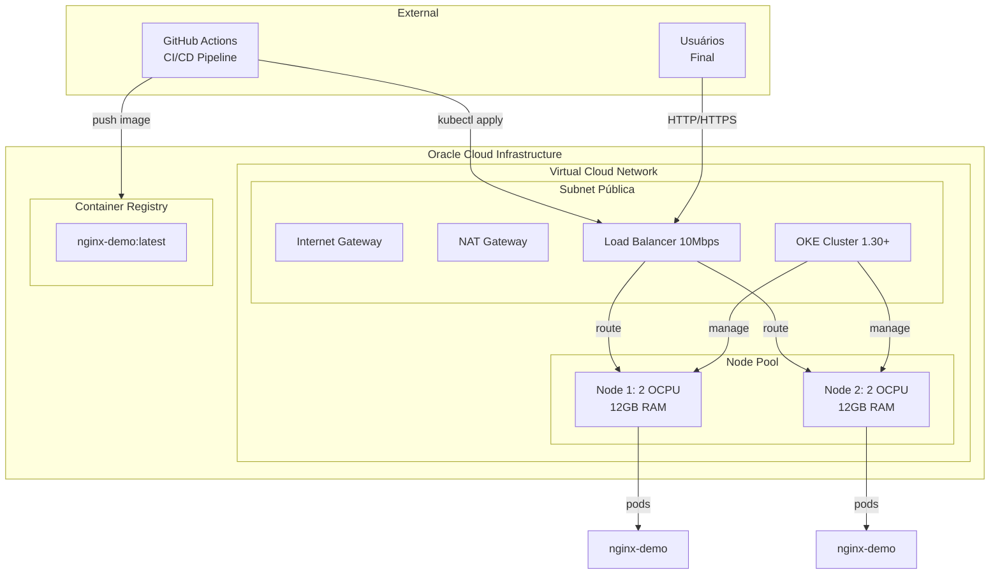
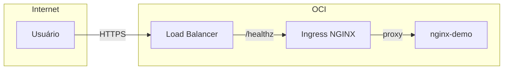
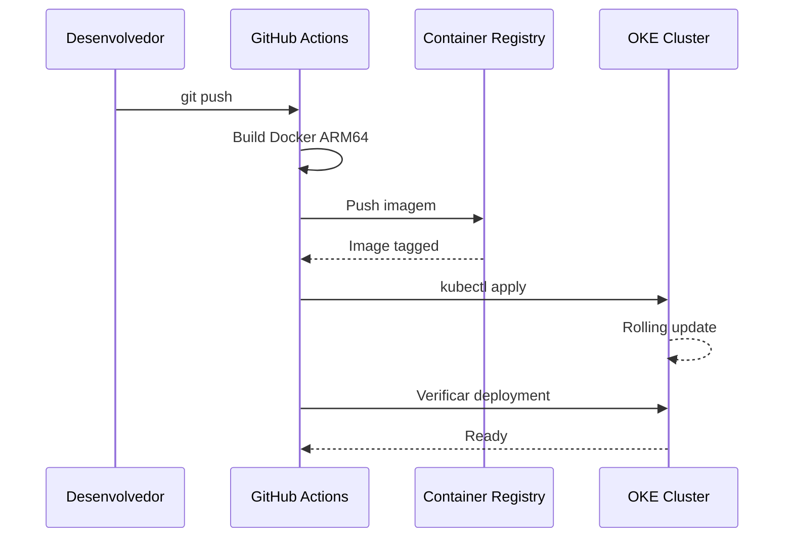

# OCI ARM Kubernetes Platform

> Plataforma Kubernetes de produção usando OKE com instâncias Ampere A1 ARM na Oracle Cloud Infrastructure.

[](https://www.oracle.com/cloud/)
[](https://kubernetes.io/)
[](https:// Ampere.com/)
[](https://www.terraform.io/)
[](LICENSE)

## Arquitetura





## Por que OCI para Kubernetes?

| Critério | OCI OKE | AWS EKS |
|---------|---------|---------|
| **Custo mensal (2 nodes)** | ~$45 USD | ~$73 USD |
| **Always Free Tier** | Sim (ARM 4 cores) | Não |
| **Type instances** | Ampere A1 Flex | t4g.medium |
| **Região Brasil** | São Paulo | São Paulo |
| **Managed Control Plane** | Gratuito | $73/mês |
| **OCI Free Tier Credits** | $300 | $100 |

### Comparação de Custos Detalhada

| Recurso | OCI OKE | AWS EKS |
|---------|---------|---------|
| **Control Plane** | Gratuito | $73/mês |
| **Nodes (2x A1 Flex)** | $28/mês | $41/mês |
| **Load Balancer** | $10/mês (10Mbps) | $16/mês (classic) |
| **Egress Internet** | ~$5/mês | ~$8/mês |
| **Block Volume (100GB)** | $10/mês | $10/mês |
| **Total Estimado** | **~$53/mês** | **~$148/mês** |

> **Economia:** ~$95/mês usando OCI OKE vs AWS EKS para workloads equivalentes.

## Especificações Técnicas

### OKE Cluster
- **Versão Kubernetes:** 1.30+
- **CNI:** Flannel Overlay
- **Endpoint:** Público (acesso kubectl)
- **Região:** sa-saopaulo-1

### Node Pool
- **Shape:** VM.Standard.A1.Flex
- **Quantidade:** 2 nodes
- **OCPUs por node:** 2 (4 cores total)
- **Memória por node:** 12 GB (24 GB total)
- **Imagem:** Oracle Linux 8 (ARM)
- **Volume Boot:** 50 GB

### Recursos Kubernetes
- **Namespace:** production
- **Deployment:** nginx-demo (ARM-compatible)
- **HPA:** min 1, max 3 réplicas
- **PDB:** minAvailable 1
- **Service:** LoadBalancer (flexible 10Mbps)
- **Ingress:** NGINX Controller via Helm

## Pré-requisitos

| Ferramenta | Versão | Instalação |
|------------|-------|------------|
| Terraform | >= 1.5 | [Guia](https://developer.hashicorp.com/terraform/install) |
| OCI CLI | Latest | `brew install oci-cli` |
| kubectl | 1.30+ | `brew install kubectl` |
| Helm | 3.14+ | `brew install helm` |
| Docker | 24+ | [Guia](https://docs.docker.com/get-docker/) |

## Instalação Rápida

### 1. Configurar credenciais OCI

```bash
# Configurar OCI CLI
oci setup config

# Variáveis de ambiente
export OCI_REGION=sa-saopaulo-1
export TF_VAR_tenancy_ocid="ocid1.tenancy.oc1..xxxxxxx"
export TF_VAR_compartment_ocid="ocid1.compartment.oc1..xxxxxxx"
```

### 2. Aplicar Terraform

```bash
cd terraform/environments/dev

terraform init
terraform plan -var-file=terraform.tfvars
terraform apply -var-file=terraform.tfvars
```

### 3. Configurar kubectl

```bash
# Obter kubeconfig do cluster
oci ce cluster create-kubeconfig \
  --cluster-id ocid1.cluster.oc1.sa-saopaulo-1.xxxxxxxx \
  --file kubeconfig \
  --region sa-saopaulo-1

# Configurar kubectl
export KUBECONFIG=kubeconfig
kubectl get nodes
```

### 4. Instalar NGINX Ingress via Helm

```bash
# Adicionar repo Helm
helm repo add ingress-nginx https://kubernetes.github.io/ingress-nginx
helm repo update

# Instalar com valores customizados
helm install ingress-nginx ingress-nginx/ingress-nginx \
  --namespace ingress-nginx \
  --create-namespace \
  -f kubernetes/helm/ingress-nginx-values.yaml
```

### 5. Deploy da aplicação

```bash
kubectl apply -f kubernetes/namespaces/production.yaml
kubectl apply -f kubernetes/deployments/nginx-demo.yaml
kubectl apply -f kubernetes/hpa/ingress.yaml
```

## Estrutura do Projeto

```
oci-arm-k8s-platform/
├── terraform/
│   ├── modules/
│   │   ├── oke-cluster/
│   │   ├── node-pool/
│   │   └── load-balancer/
│   └── environments/
│       └── dev/
│           ├── main.tf
│           ├── variables.tf
│           ├── outputs.tf
│           └── terraform.tfvars
├── kubernetes/
│   ├── namespaces/
│   │   └── production.yaml
│   ├── deployments/
│   │   └── nginx-demo.yaml
│   ├── helm/
│   │   └── ingress-nginx-values.yaml
│   └── hpa/
│       └── ingress.yaml
├── app/
│   ├── Dockerfile
│   ├── nginx.conf
│   ├── index.html
│   └── health.html
├── .github/
│   └── workflows/
│       ├── ci-cd.yaml
│       └── terraform.yaml
└── README.md
```

## Verificar Workload ARM

```bash
# Verificar arquitetura dos nodes
kubectl get nodes -o wide

# Descrever node para verificar arquitetura
kubectl describe node | grep -i architecture
kubectl describe node | grep ProviderID

# Verificar pods em execução
kubectl get pods -n production -o wide

# Verificar se pods estão em nodes ARM
kubectl get pods -n production -o jsonpath='{range .items[*]}{.metadata.name}{"\t"}{.spec.nodeName}{"\t"}{.status.conditions[*].type}{"\n"}{end}'
```

### Saída esperada:

```
NAME                        NODE           STATUS
nginx-demo-7f9c4b8a5-x2h9p  oke-node-1    Running
nginx-demo-7f9c4b8a5-y4k8n  oke-node-2    Running
```

## GitHub Actions Secrets

| Secret | Descrição |
|--------|---------|
| `OCI_USERNAME` | Username OCI (formato: tenancy/nome) |
| `OCI_AUTH_TOKEN` | Token de autenticação OCIR |
| `OCI_API_KEY` | Chave API OCI |
| `OCI_TENANCY_OCID` | OCID do Tenancy |
| `OCI_COMPARTMENT_OCID` | OCID do Compartment |
| `OCI_CLUSTER_ID` | OCID do Cluster OKE |
| `OCI_NAMESPACE` | Namespace do OCIR |

## Pipeline CI/CD

### Fluxo



## Recursos CRIados

### Terraform
- [x] VCN com CIDR 10.0.0.0/16
- [x] Subnet pública
- [x] Internet Gateway
- [x] NAT Gateway
- [x] Route Tables
- [x] Security Lists
- [x] OKE Cluster
- [x] Node Pool (2 nodes A1 Flex)

### Kubernetes
- [x] Namespace: production
- [x] ResourceQuota
- [x] LimitRange
- [x] Deployment: nginx-demo
- [x] Service: LoadBalancer
- [x] ConfigMap: nginx-config
- [x] HorizontalPodAutoscaler
- [x] PodDisruptionBudget
- [x] IngressClass: nginx
- [x] Ingress: nginx-demo

## Troubleshooting

### Verificar logs do cluster

```bash
# Status do cluster
oci ce cluster get --cluster-id $CLUSTER_ID --query 'data.status'

# Logs do node pool
kubectl logs -n kube-system -l k8s-app=oci-node-init

# Verificar eventos
kubectl get events -n production --sort-by='.lastTimestamp'
```

### Problemas comuns

| Problema | Solução |
|----------|--------|
| Node não ready | Verificar CNI (`kubectl get pods -n kube-system`) |
| Image pull error | Verificar credenciais OCIR |
| HPA não escala | Verificar métricas server |
| LB sem IP | Aguardar 2-5 minutos |

## Licença

MIT - See [LICENSE](LICENSE) for details.

## Referências

- [Documentação OCI OKE](https://docs.oracle.com/en-us/iaas/Content/ContEng/Concepts/contengoverview.htm)
- [Terraform Provider OCI](https://registry.terraform.io/providers/oracle/oci/latest)
- [Ampere A1 Instances](https://docs.oracle.com/en-us/iaas/Content/Compute/References/amperecompute.htm)
- [Kubernetes Documentation](https://kubernetes.io/docs/)
- [Ingress NGINX Helm Chart](https://kubernetes.github.io/ingress-nginx/)

---

**Tópicos:** `oracle-cloud` `oci` `kubernetes` `oke` `arm` `ampere` `terraform` `devops` `always-free`