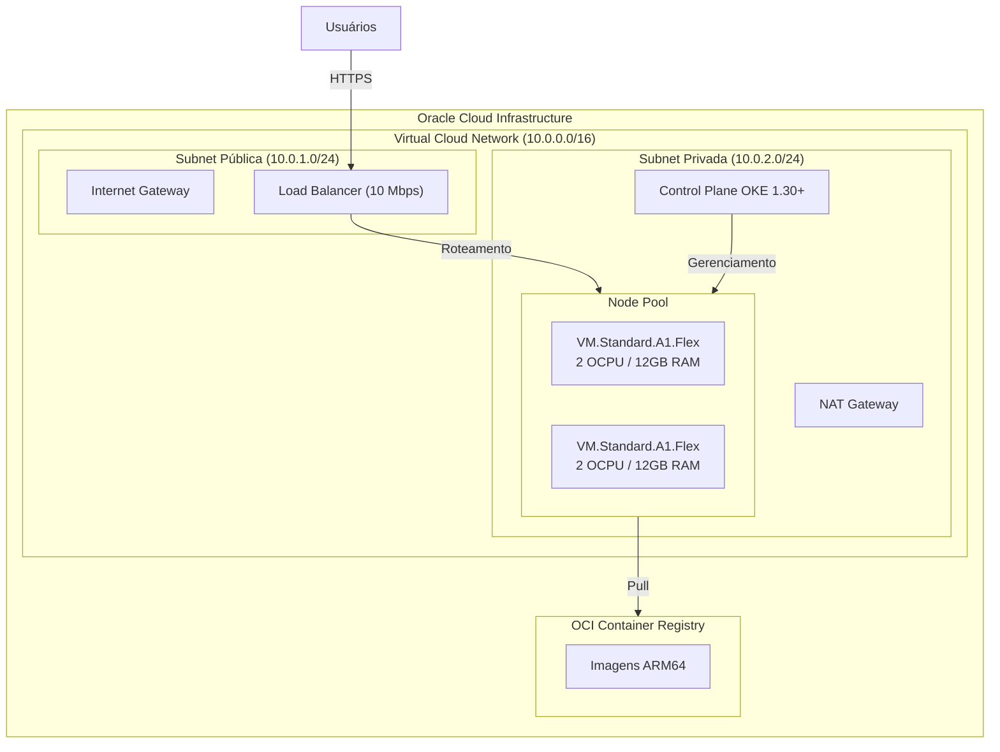

# Documentação de Arquitetura

Esta documentação detalha as decisões técnicas, a topologia de infraestrutura e a arquitetura de software implementada para o projeto **OCI ARM Kubernetes Platform**.

## 1. Visão Geral
A arquitetura foi projetada para fornecer uma infraestrutura Kubernetes nativa em nuvem (Cloud-Native) de baixo custo, alta disponibilidade e compatível com cargas de trabalho baseadas em ARM (AArch64), utilizando primariamente os recursos do *Always Free Tier* da Oracle Cloud Infrastructure (OCI).

## 2. Diagrama de Arquitetura

## 3. Decisões de Design de Infraestrutura (OCI)

### 3.1. Rede (VCN)
* **Bloco CIDR**: Foi definido um bloco `10.0.0.0/16` para permitir farto endereçamento IP para os Pods e Nodes.
* **Isolamento de Rede**:
  * **Subnet Pública**: Contém recursos que precisam ser acessados pela internet, restritos apenas ao **Load Balancer**.
  * **Subnet Privada**: Contém os Nodes do Kubernetes e o Control Plane. Os workers não são acessíveis diretamente pela internet, garantindo maior segurança. Eles utilizam o NAT Gateway para baixar pacotes e se comunicar com o OCIR.

### 3.2. Oracle Kubernetes Engine (OKE)
* O OKE atua como provedor do Control Plane gerenciado.
* **Rede de Overlay (CNI)**: A configuração utiliza `Flannel` como plugin de rede (CNI), que é leve e funciona perfeitamente para clusters pequenos/médios em ambientes ARM.

### 3.3. Computação (Node Pool)
* **Shape**: `VM.Standard.A1.Flex` baseada nos processadores Ampere Altra (ARM64).
* **Capacidade**: 2 nós distribuídos. Cada um com 2 OCPUs e 12 GB de RAM, aproveitando o total de recursos do *Free Tier* da OCI (4 OCPUs e 24 GB RAM totais).
* **SO**: Oracle Linux 8 otimizado para ARM.
* **Armazenamento**: 50 GB de Boot Volume por node.

## 4. Arquitetura de Software (Kubernetes)

O cluster hospeda a stack de aplicação seguindo o modelo de separação lógica de recursos:

### 4.1. Namespaces
* `ingress-nginx`: Para centralizar o controlador de tráfego de entrada.
* `production`: Contém os recursos de negócio (Deployment, HPA, Services).
* `kube-system`: Essenciais do cluster (CoreDNS, kube-proxy, CNI).

### 4.2. Roteamento (Ingress)
Todo o tráfego HTTP/HTTPS entra pelo OCI Load Balancer que está vinculado ao Service do **NGINX Ingress Controller**. O Ingress Controller roteia internamente as requisições para a aplicação correta baseando-se nas regras de hostname e path (ex: Ingress resource `nginx-demo`).

### 4.3. Resiliência e Escalabilidade (HPA e PDB)
* **HorizontalPodAutoscaler (HPA)**: Monitora a utilização de CPU dos pods. Se a aplicação (`nginx-demo`) sofrer um pico, o HPA escalará automaticamente o número de Pods até o máximo de 3 réplicas.
* **PodDisruptionBudget (PDB)**: Garante que durante manutenções voluntárias (como drain de nodes para atualização de versão do SO), no mínimo 1 réplica da aplicação estará disponível (`minAvailable: 1`), evitando downtime do sistema.

## 5. Fluxo de CI/CD e Registro

A integração é feita primariamente pelo **GitHub Actions**:
1. **Compilação**: Docker constrói a imagem com a diretiva `platforms: linux/arm64`. Isso é estritamente obrigatório para que os binários rodem nos Ampere A1.
2. **Armazenamento**: A imagem é empurrada para o OCI Container Registry (OCIR).
3. **Delivery**: O pipeline atualiza o arquivo de deployment no cluster OKE autenticando-se via OCI CLI (utilizando chaves efêmeras configuradas nos Secrets do repositório).

## 6. Segurança
* **Network Security Groups (NSGs) / Security Lists**: Bloqueiam tráfego não autorizado. O Load Balancer só aceita conexões nas portas 80/443. Os workers aceitam comunicação apenas do Control Plane, do Load Balancer e tráfego intra-cluster.
* **Políticas de IAM**: Criação de usuários restritos e chaves de API apenas para uso programático (CI/CD).
